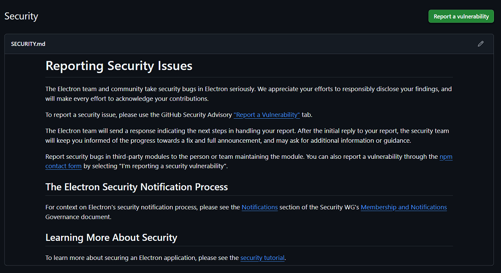

# Streamlining CVE Research using GitHub

## Introduction

[Common Vulnerabilities and Exposures](https://nvd.nist.gov/general/cve-process) (CVEs) provide a standard framework for identifying and cataloging security issues. They allow researchers and organizations to track vulnerabilities consistently, assess potential impact, and coordinate mitigation efforts.

While the formal CVE request and assignment process can be slow and cumbersome, GitHub offers tools that streamline the initial steps: public repositories often include a `SECURITY.md` file, which provides a straightforward way to report vulnerabilities affecting open-source projects.\
This reduces overhead and allows researchers to focus on understanding and reproducing vulnerabilities safely.

This article highlights both GitHub's efficient vulnerability reporting workflow and the issues I discovered during my initial CVE research exercise, illustrating how structured repository information can accelerate responsible vulnerability discovery.

***

## Repository Selection Process

The first step of the exercise was to identify open-source, self-hosted tools, allowing me to carry out the research independently and safely - without risking harm to real systems or users. To select potential target repositories, I used [Awesome-selfhosted](https://github.com/awesome-selfhosted/awesome-selfhosted), but there are many other sources available. Once I identified interesting repositories, I immediately checked for the presence of a Security section containing a proper `SECURITY.md` file.

An example repository with a properly configured security section is [Electron](https://github.com/electron/electron/security).\
Notice the _"Report a vulnerability"_ button in the top-right corner.

<div align="left"><figure><figcaption></figcaption></figure></div>

During my initial research, the [I-Librarian](https://github.com/mkucej/i-librarian-free) and [NoteMark](https://github.com/enchant97/note-mark) repositories caught my attention. I confirmed that both included a properly configured security section and then followed their instructions to set their corresponding web applications in my local environment.

After spending some time analyzing the projects' source code, I confirmed the existence of three distinct entry points for _Stored XSS_ vulnerabilities caused by insufficient input validation. Although the codebases generally demonstrated attention to sanitization, specific areas lacked full protection.\
This illustrates how even a single overlooked input path can introduce a security weakness.

For each CVE, I documented the steps required to reproduce the issues, the payloads used, and proof-of-concept demonstrations. I also pinpointed the exact location of the vulnerability within the application’s code. Once the analysis was complete, I submitted the findings through the GitHub repositories’ security sections. This process allowed me to claim the CVE identifiers within just a few days, demonstrating how straightforward the GitHub CVE request workflow can be and allowing me to focus on the research itself.

The CVE identifiers assigned through this research are the following:

* [CVE-2024-41819](https://nvd.nist.gov/vuln/detail/CVE-2024-41819)
* [CVE-2024-41943](https://nvd.nist.gov/vuln/detail/CVE-2024-41943)
* [CVE-2024-50344](https://nvd.nist.gov/vuln/detail/CVE-2024-50344)

The following sections provide a brief overview of the CVEs identified during this research.


All repositories have since been updated, and applying the latest versions resolves the identified issues.


***

## CVE-2024-41819

### Vulnerability Description

NoteMark is an open-source web-based Markdown notes application.\
A stored cross-site scripting (XSS) vulnerability in NoteMark allows attackers to execute arbitrary scripts via a crafted payload injected into the URL value of a link in the markdown content.

This vulnerability affects version 0.13.0 and below and was fixed in 0.13.1.

***

### Steps to Reproduce <a href="#steps-to-reproduce" id="steps-to-reproduce"></a>

1. Log in to the application and create a new note or enter a previously created note.
2. Access the note editor functionality from the selected note by clicking on the "Editor" tab.
3. Input the following payload: `[xss-link](javascript:alert(1))`
4. Save the changes and click on the "Rendered" tab to view the rendered markdown version of the note. Click on the previously created link to pop the injected alert.

***

### Proof of Concept  <a href="#proof-of-concept" id="proof-of-concept"></a>

```http
PUT /api/notes/<note-uuid>/content HTTP/1.1
Host: localhost:8000
Accept: */*
Content-Type: text/plain;charset=UTF-8
Content-Length: 34
Sec-Fetch-Site: same-origin
Authorization: Bearer <TOKEN>


[xss-link](javascript:alert(1))
```

***

## CVE-2024-41943

### Vulnerability Description

I, Librarian is an open-source version of a PDF managing SaaS. PDF notes are displayed on the Item Summary page without any form of validation or sanitation.

An attacker can exploit this vulnerability by inserting a payload in the PDF notes that contains malicious code or script. This code will then be executed when the page is loaded in the browser. The vulnerability was fixed in version 5.11.1.

***

### Steps to Reproduce <a href="#steps-to-reproduce" id="steps-to-reproduce"></a>

1. Import a PDF file and navigate to its summary by clicking on the imported PDF file's name in the Items menu in the dashboard
2. Click on the "Pdf" button under the file's name in the top-side of the page to navigate to the file's preview, then click on the "Annotations" button in the top menu to save a comment containing an XSS payload such as: `<script>alert(1)</script>`
3. The stored XSS payload will be triggered any time a user visits the targeted PDF's summary.

***

### Proof of Concept <a href="#proof-of-concept" id="proof-of-concept"></a>

```http
POST /librarian/index.php/pdf/savenote HTTP/1.1
Host: 127.0.0.1:8080
User-Agent: Mozilla/5.0 (Windows NT 10.0; Win64; x64; rv:129.0) Gecko/20100101 Firefox/129.0
Accept: application/json, text/javascript, */*; q=0.01
Content-Type: application/x-www-form-urlencoded; charset=UTF-8
X-Client-Width: 1280
X-Requested-With: XMLHttpRequest
Content-Length: 138
Origin: http://127.0.0.1:8080
Referer: http://127.0.0.1:8080/librarian/index.php/item
Cookie: IL=<cookie>

note=%3Cscript%3Ealert(1)%3C%2Fscript%3E&pg=1&top=1&left=1&id=<pdf-id>&csrfToken=<token>
```

## CVE-2024-50344

### Vulnerability Description

I, Librarian is an open-source version of a PDF managing SaaS.

Supplemental Files are allowed to be viewed in the browser, only if they have a white-listed MIME type. Unfortunately, this logic is broken, thus allowing unsafe files containing JavaScript to be executed with the application context.

An attacker can exploit this vulnerability by uploading a supplementary file that contains a malicious code or script. This code will then be executed when the file is loaded in the browser.

The vulnerability was fixed in version 5.11.2.

***

### Steps to Reproduce <a href="#steps-to-reproduce" id="steps-to-reproduce"></a>

1. Login and upload a malicious HTML file containing _**any JavaScript payload**_.
2. Exploit the file download functionality to display any file inside the browser by injecting the response's Content-Disposition header.
3. To do that, navigate to the malicious HTML supplement file and edit the download link by adding the extra parameter `&disposition`, without even specifying any value for it.
4. This causes the web application's response to set the Content-Disposition header's value to inline.

### Proof of Concept

No exploit code is published here. The XSS can be triggered using any standard JavaScript payload.

***

## References

* [https://nvd.nist.gov/vuln/detail/CVE-2024-41819](https://nvd.nist.gov/vuln/detail/CVE-2024-41819)
* [https://nvd.nist.gov/vuln/detail/CVE-2024-41943](https://nvd.nist.gov/vuln/detail/CVE-2024-41943)
* [https://nvd.nist.gov/vuln/detail/CVE-2024-50344](https://nvd.nist.gov/vuln/detail/CVE-2024-50344)
* [https://github.com/enchant97/note-mark](https://github.com/enchant97/note-mark)
* [https://github.com/mkucej/i-librarian-free](https://github.com/mkucej/i-librarian-free)
* [https://github.com/awesome-selfhosted/awesome-selfhosted](https://github.com/awesome-selfhosted/awesome-selfhosted)
* [https://nvd.nist.gov/general/cve-process](https://nvd.nist.gov/general/cve-process)
* [https://github.com/electron/electron/security](https://github.com/electron/electron/security)
